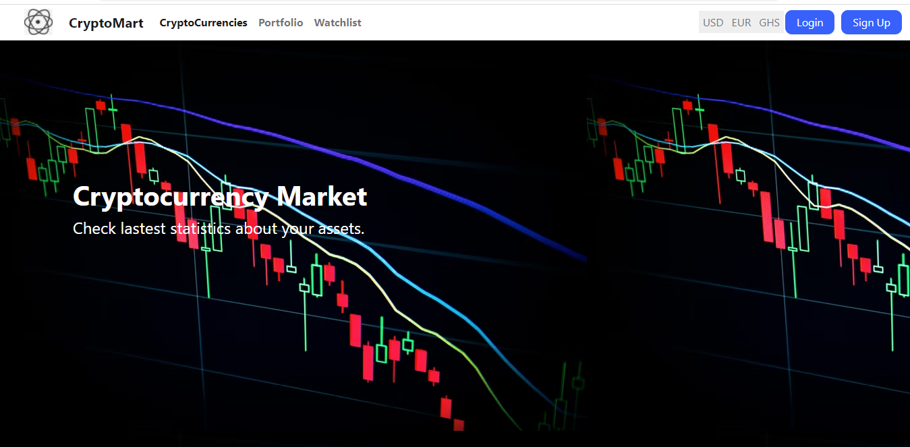
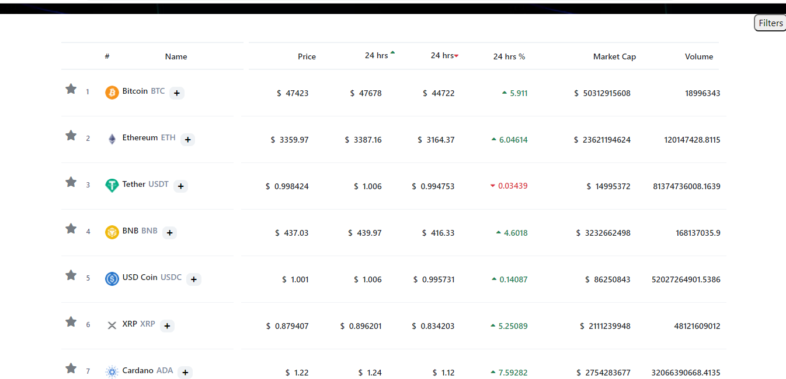

# Project Title: Cryptocurrency Market

# Project Objective

An application thats gives lastest statistics about user assets and also allow user to add assets and get information about their assets.

### Customer Requirements

Users should be able to:
- View active cryptocurrencies with latest market data and sort.
- View information about a cryptocurrency
- Add new asset to his/her portfolio
- View statistics about his/her asset
- Update his/her portfolio
- Get insights into his/her portfolio
-Add cryptocurrency to his/her watchlist 

### Links

- Solution URL: [https://github.com/ntiBoateng/cryptocurrency-market](https://github.com/ntiBoateng/cryptocurrency-market)
- Live Site URL: [https://cryptocurrency-market.netlify.app/](https://cryptocurrency-market.netlify.app)

- Solution URL: [https://github.com/Ramsonodoi/CryptocurrencyMarket](https://github.com/Ramsonodoi/CryptocurrencyMarket)
- Live Site URL: [] ()

### Landing Page

### CryptoCurrencies Table

### Detail of Every Coin

## Our process

A team of two developers, one front-end developer and one back-end developer used React and   

### Built with
- [React](https://reactjs.org/) - JS library
- [React Router](https://reactrouter.com/) - For user interfaces
- [Bootstrap](https://getbootstrap.com/) - For UI interface elements
- [MaterialUI](https://mui.com/) - Front-end framework for React Components

## Authors
- GitHub - [RamsonOdoi](https://github.com/Ramsonodoi)
- GitHub - [GideonNtiBoateng](https://github.com/ntiBoateng)

